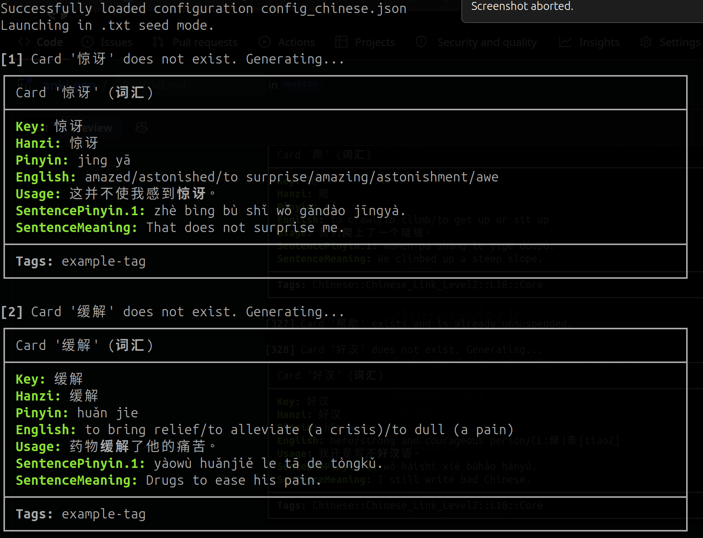

# anki-gen

A configurable tool for generating Anki vocabulary cards.



## Usage

```bash
python3 main.py [-h] -p PATH -m CARD_TYPE [-r] [-d DECK_NAME] [-t TAG] [-c CONFIG] [-v [{0,1,2}]]
```

### Arguments

| Option | Description |
|---|---|
| `-h`, `--help` | Show help message and exit |
| `-c CONFIG`, `--config CONFIG` | Path to .json configuration file |
| `-p PATH`, `--path PATH` | Path to .txt/.csv containing 'seeds' for card generation |
| `-r`, `--preview` | Preview mode. Cards are not added to Anki |
| `-m CARD_TYPE`, `--model CARD_TYPE` | Name of the Anki card type for card creation |
| `-d DECK_NAME`, `--deck DECK_NAME` | Name of the Anki deck that cards should be added to |
| `-t TAG(S)`, `--tag TAG(S)` | Tag(s) to apply to imported cards |
| `-v [{0,1,2}]`, `--verbose [{0,1,2}]` | Verbosity level |

## Example Usage:
The following gives the output pictured above:

```bash
python3 main.py -d New -p my_vocabulary_list.txt -m 词汇 -t example-tag -v
```

`my_vocabulary_list.txt`:

```text
惊讶
缓解
...
```
## Dependencies

Requires Python 3 or later and the following dependencies:
- `pypinyin`
- `sqlite3`
- `wcwidth`
- `pypinyin` (If `lang` is set to `zh`)
- `jieba` (If `lang` is set to `zh`)

You'll also need to have the [AnkiConnect](https://ankiweb.net/shared/info/2055492159) plug-in installed. Anki must be open while the script is running.

## JSON Config Format

The config file defines how the database columns map onto Anki note fields, as well as some other configuration options. 

Example `example_config.jsonc`:

```jsonc
{
  "__config__": {
    "anki_seed_field": "Hanzi",                         // Anki field associated with the "seed"
    "anki_seed_field_copyto": "Key",                    // Other anki field(s) you wish to copy the seed to		
    "check_seed_distinct_word": "Usage",                // Use NLP to check that the seed is present in these fields as a distinct word
    "edge_tts_generate": {"Hanzi": "Audio"},			// Dictionary for TTS generation. FROM_FIELD -> TO_FIELD
    "seed_bwrap_fields": "Usage",						// Fields where we should wrap the seed in <b> ... </b>
    "pinyin_fields": ["Pinyin", "SentencePinyin.1"]     // Fields where Pinyin is present (automatically formats and converts to tone marks)
  },

  "data/cedict.db": {                                   // Database file to configure
    "name": "cedict",									// Internal name of the database
    "lang": "zh",										// Language
    "condition": "simplified='{{seed}}'",               // Condition after SQL WHERE for selecting data
    "fields": {                                         // Mapping from database to Anki field(s)
      "simplified": ["Key", "Hanzi"],					// Here the column "simplified" gets mapped to the fields "Key" & "Hanzi"
      "pinyin": "Pinyin",
      "english": "English"
    }
  },

  "data/chin_example_sen.db": {
    "name": "examples",
    "lang": "zh",
	"condition": "simplified LIKE '%{{seed}}%'",
    "fields": {
      "simplified": "Usage",
      "pinyin": "SentencePinyin.1",
      "english": "SentenceMeaning"
      }
  }
}
```

## Input File Format

Cards can also be generated with individual tags. You can import a CSV file with the following format:

Example:

```csv
seed,tag
美丽,lesson-1
大楼,lesson-1
小笼包,lesson-2
```
